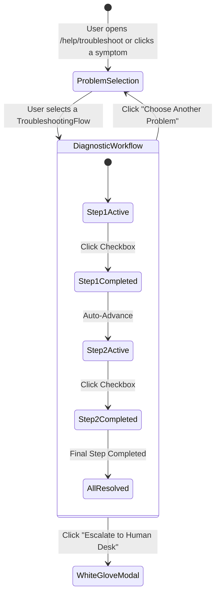

# DocentBase Help Center Architecture & Debugger Audit Report

> **Location:** `/docs/debugger/help-section-architecture-and-audit.md`  
> **Target Subpath:** `https://docentbase.com/help`  
> **Source Directory:** `src/app/help/`, `src/components/help/`, `src/data/help-articles.ts`  
> **Deployment Target:** Cloudflare Workers via `@opennextjs/cloudflare` + `wrangler`  
> **Status:** Production Live  

---

## Table of Contents

1. [Executive Summary](#1-executive-summary)
2. [Directory & File System Architecture](#2-directory--file-system-architecture)
3. [Component & Function Registry](#3-component--function-registry)
4. [Data Layer Schema & Taxonomy](#4-data-layer-schema--taxonomy)
5. [Developer Guide: How New Articles Are Created & Rendered](#5-developer-guide-how-new-articles-are-created--rendered)
6. [Interactive Problem Solver State Machine](#6-interactive-problem-solver-state-machine)
7. [Comprehensive Debugger Audit: Bugs, Edge Cases & Deficiencies](#7-comprehensive-debugger-audit-bugs-edge-cases--deficiencies)
8. [Actionable Remediation Plan for Successor Agents](#8-actionable-remediation-plan-for-successor-agents)

---

## 1. Executive Summary

The **DocentBase Help Center** was migrated from a standalone subdomain (`help.docentbase.com`) into the root domain directory (`docentbase.com/help`) within the `docent-landing` application. This architecture consolidates domain authority, improves SEO ranking for long-tail academic search queries (e.g. *"bKash tuition fee integration"*, *"biometric coaching attendance"*), and enables unified deployment through Cloudflare Workers.

### Key Capabilities
- **Portal-Aware Knowledge Filtering**: Real-time filtering across `All`, `Admin / Teachers (admin.docentbase.com)`, and `Students & Parents (student.docentbase.com)`.
- **Bilingual Interface**: Seamless instant toggle between English (EN) and Bengali (BN).
- **Interactive Self-Service Diagnostics**: Step-by-step troubleshooting wizards for payment reconciliation, join codes, hardware scanning, and SMS delivery.
- **White-Glove Support Concierge**: Multi-tab support modal for free data migration, on-site engineer dispatch, and WhatsApp hotline.
- **100% Static Pre-Rendering (SSG)**: All articles are pre-rendered at build time with Next.js 14 `generateStaticParams`.

---

## 2. Directory & File System Architecture

```
/Users/solaman/project/docent-landing/
├── docs/
│   └── debugger/
│       ├── README.md                                  # Index pointer for agents
│       └── help-section-architecture-and-audit.md     # This comprehensive document
├── public/
│   ├── logo.png                                       # Main brand asset
│   ├── logo.jpg                                       # Fallback raster asset
│   └── logo-transparent.png                           # Transparent logo asset
├── src/
│   ├── app/
│   │   ├── help/
│   │   │   ├── layout.tsx                             # Top-level SEO metadata for /help
│   │   │   ├── page.tsx                               # Help Center index & category browser
│   │   │   ├── troubleshoot/
│   │   │   │   └── page.tsx                           # Standalone Troubleshooter route
│   │   │   └── articles/
│   │   │       └── [slug]/
│   │   │           └── page.tsx                       # Dynamic SSG article reader
│   │   ├── sitemap.ts                                 # Unified sitemap including all /help URLs
│   │   └── globals.css                                # Global styles (includes .swiss-grid-pattern)
│   ├── components/
│   │   └── help/
│   │       ├── articles/
│   │       │   └── ArticleClientView.tsx              # Article reader layout, feedback & sidebar
│   │       ├── layout/
│   │       │   ├── Header.tsx                         # Help header with search & language switch
│   │       │   └── Footer.tsx                         # Help footer with deep links
│   │       ├── search/
│   │       │   └── CommandPalette.tsx                 # ⌘K instant search across articles & flows
│   │       ├── support/
│   │       │   └── WhiteGloveModal.tsx                # Data entry & engineer dispatch modal
│   │       ├── troubleshoot/
│   │       │   └── InteractiveTroubleshooter.tsx      # Diagnostic interactive step runner
│   │       └── ui/
│   │           ├── Callout.tsx                        # Tip/Important/Warning/Note & Status badges
│   │           ├── CopyButton.tsx                     # 1-click clipboard utility
│   │           └── ProductFrame.tsx                   # Browser mockup container
│   ├── data/
│   │   └── help-articles.ts                           # Single Source of Truth data store
│   └── lib/
│       └── utils.ts                                   # clsx + twMerge utility (`cn`)
├── next.config.mjs                                    # Next.js config with 301 redirects
├── open-next.config.ts                                # Cloudflare adapter configuration
└── wrangler.json                                      # Cloudflare Worker routes and assets
```

---

## 3. Component & Function Registry

### 3.1 UI Primitives (`src/components/help/ui/`)

| Component | File Path | Props | Purpose |
| :--- | :--- | :--- | :--- |
| `Callout` | `src/components/help/ui/Callout.tsx` | `type?: "tip" \| "important" \| "warning" \| "note"`, `children`, `className?` | Renders color-coded operational alert boxes with icons. |
| `StatusBadge` | `src/components/help/ui/Callout.tsx` | `status?: "ACTIVE" \| "PENDING" \| "RESOLVED" \| "DEPRECATED"`, `portal?: "admin" \| "student" \| "all"` | Pill badge displaying portal context or article lifecycle state. |
| `CopyButton` | `src/components/help/ui/CopyButton.tsx` | `text: string`, `className?: string` | Copies text/URL to clipboard with 2-second checkmark feedback. |
| `ProductFrame` | `src/components/help/ui/ProductFrame.tsx` | `url?: string`, `badge?: string`, `children`, `className?` | Browser mockup with custom domain URL bar and pulsing status dot. |

### 3.2 Layout Components (`src/components/help/layout/`)

| Component | File Path | Props | Features |
| :--- | :--- | :--- | :--- |
| `Header` | `src/components/help/layout/Header.tsx` | `activePortal?`, `onSelectPortal?`, `language?`, `onToggleLanguage?` | Utility sub-bar (portal links, language switch, hotline), Main navigation with search trigger (⌘K), portal switch pills, and white-glove modal trigger. |
| `Footer` | `src/components/help/layout/Footer.tsx` | *None* | 5-column corporate layout with deep links to Admin articles, Student articles, direct portals, and diagnostic wizards. |

### 3.3 Feature Modules (`src/components/help/`)

| Component | File Path | Key Functions / State | Description |
| :--- | :--- | :--- | :--- |
| `ArticleClientView` | `src/components/help/articles/ArticleClientView.tsx` | `feedbackGiven`, `supportOpen` | Editorial layout with breadcrumbs, summary box, step checklists, callouts, helpfulness voting, and related article sidebar. |
| `InteractiveTroubleshooter` | `src/components/help/troubleshoot/InteractiveTroubleshooter.tsx` | `selectedFlow`, `activeStep`, `completedSteps`, `handleToggleStepComplete`, `handleReset` | Interactive diagnostic tree. Users choose symptoms, work through resolution steps, check off tasks, or escalate to engineering. |
| `CommandPalette` | `src/components/help/search/CommandPalette.tsx` | `query`, `searchResults`, `handleSelect` | Modal search filtering both `HELP_ARTICLES` and `TROUBLESHOOTING_FLOWS` with instant navigation. |
| `WhiteGloveModal` | `src/components/help/support/WhiteGloveModal.tsx` | `activeTab` (`data-entry` \| `engineer` \| `whatsapp`), `formData`, `submitted` | Lead capture for data digitization and on-site hardware engineer visits. |

---

## 4. Data Layer Schema & Taxonomy

The data layer resides entirely in `src/data/help-articles.ts`. It acts as the typed headless CMS.

### 4.1 TypeScript Interfaces

```typescript
export type PortalType = "all" | "admin" | "student";

export interface HelpSection {
  heading: string;
  content: string;
  steps?: string[];
  callout?: {
    type: "tip" | "important" | "warning" | "note";
    text: string;
  };
}

export interface HelpArticle {
  id: string;
  slug: string;
  title: string;
  titleBn: string;
  category: string;
  categoryName: string;
  portal: PortalType;
  readTime: string;
  lastUpdated: string;
  summary: string;
  summaryBn: string;
  keywords: string[];
  sections: HelpSection[];
  relatedSlugs: string[];
}

export interface TroubleshootingStep {
  title: string;
  description: string;
  actionUrl?: string;
  actionText?: string;
}

export interface TroubleshootingFlow {
  id: string;
  problem: string;
  problemBn: string;
  category: string;
  portal: PortalType;
  symptoms: string[];
  rootCauses: string[];
  steps: TroubleshootingStep[];
  escalationTip: string;
}
```

### 4.2 Category Taxonomy (`HELP_CATEGORIES`)
1. `getting-started`: Initial organization setup & onboarding
2. `attendance-tracking`: Biometric, USI barcodes, and 3-second rapid web attendance
3. `fee-collection`: Grace periods, bKash/Nagad checkout, automated receipts
4. `sms-communication`: BTRC-approved masking/non-masking alerts & 10-point reports
5. `student-portal`: Student & parent cockpit (`student.docentbase.com`)
6. `white-glove-ops`: Free human data entry, register digitization, on-site hardware setup

---

## 5. Developer Guide: How New Articles Are Created & Rendered

Follow these steps to add a new documentation guide:

### Step 1: Add the Article Object to `src/data/help-articles.ts`
Append the new article object to the `HELP_ARTICLES` array:

```typescript
{
  id: "sms-gateway-setup",
  slug: "sms-gateway-setup",
  title: "Connecting Custom Telco Masking Gateway for Parent Alerts",
  titleBn: "প্যারেন্ট সতর্কতার জন্য কাস্টম টেলকো মাস্কিং গেটওয়ে সংযোগ",
  category: "sms-communication",
  categoryName: "Parent Communications & SMS",
  portal: "admin",
  readTime: "5 min read",
  lastUpdated: "August 2026",
  summary: "Configure custom sender IDs (e.g. ACADEMY-NAME) and manage BTRC DND filtering for automated SMS delivery.",
  summaryBn: "কাস্টম সেন্ডার আইডি কনফিগার এবং স্বয়ংক্রিয় এসএমএস ডেলিভারি পরিচালনা করুন।",
  keywords: ["sms", "masking", "btrc", "parent alert", "telco", "sender id"],
  sections: [
    {
      heading: "1. Applying for Masking Sender ID",
      content: "Submit your Trade License to DocentBase Support to register your 11-character alphanumeric sender ID.",
      steps: [
        "Navigate to Admin Settings > SMS Configuration",
        "Enter desired Sender ID (max 11 characters)",
        "Attach PDF copy of institution trade license"
      ],
      callout: {
        type: "important",
        text: "BTRC approval takes 48 to 72 business hours."
      }
    }
  ],
  relatedSlugs: ["parent-reports-sms", "admin-quickstart"]
}
```

### Step 2: Build Mechanics (Automated via Next.js)
When `npm run build` or `npm run deploy` is executed:
1. `src/app/help/articles/[slug]/page.tsx` calls `generateStaticParams()`.
2. Next.js discovers the new slug (`sms-gateway-setup`) and renders the static HTML & JSON at build time.
3. `generateMetadata()` generates the page `<title>`, `<meta name="description">`, keywords, and OpenGraph tags.
4. `src/app/sitemap.ts` automatically iterates over `HELP_ARTICLES` and includes `https://docentbase.com/help/articles/sms-gateway-setup` in `/sitemap.xml` with `priority: 0.8`.

---

## 6. Interactive Problem Solver State Machine

The Troubleshooter (`src/components/help/troubleshoot/InteractiveTroubleshooter.tsx`) operates on a simple declarative state machine:



---

## 7. Comprehensive Debugger Audit: Bugs, Edge Cases & Deficiencies

During our rigorous inspection of the merged codebase, the following bugs, architectural discrepancies, and improvement areas were discovered:

### ⚠️ Bug 1: Global `⌘K` Keyboard Shortcut Does Not Open CommandPalette
- **Location:** `src/components/help/search/CommandPalette.tsx` line 19-35
- **Root Cause:** The `useEffect` listening for `keydown` (`⌘K` or `Ctrl+K`) is inside `CommandPalette.tsx`. However, when `isOpen` is `false`, the component returns `null` at `if (!isOpen) return null;` — removing the component and its event listener from the DOM.
- **Impact:** Users pressing `⌘K` anywhere on `/help` or `/help/articles/*` get no response. Only clicking the search button opens the modal.
- **Fix:** Move the global `keydown` listener to the parent layout (`src/app/help/layout.tsx` or a custom hook `useCommandPalette`) or keep `CommandPalette` always mounted with CSS visibility/modal portal.

---

### ⚠️ Bug 2: Mismatched `relatedSlugs` References in `src/data/help-articles.ts`
- **Location:** `src/data/help-articles.ts` in multiple articles (e.g. `rapid-attendance`, `monthly-payments`, `parent-reports-sms`).
- **Root Cause:** The following strings were used in `relatedSlugs`:
  - `troubleshoot-attendance-offline`
  - `troubleshoot-bkash-pending`
  - `troubleshoot-sms-not-delivered`
  - `troubleshoot-join-code-expired`
  These strings do not exist in `HELP_ARTICLES.slug` (and the troubleshooting flow IDs are actually `attendance-device-offline`, `bkash-pending`, `sms-delivery-failed`, `join-code-invalid`).
- **Impact:** `ArticleClientView` filters related articles using `article.relatedSlugs.includes(a.slug)`. Because these slugs don't match any article, no related guide is displayed in the sidebar for these entries.
- **Fix:** Update `relatedSlugs` to valid article slugs (e.g. `rapid-attendance`, `payment-gateways`, `join-code-guide`, `parent-reports-sms`).

---

### ⚠️ Bug 3: `CopyButton` Empty String Evaluation on Initial Hydration
- **Location:** `src/components/help/articles/ArticleClientView.tsx` line 57 & `src/components/help/ui/CopyButton.tsx`
- **Root Cause:** `ArticleClientView.tsx` passes `text={typeof window !== "undefined" ? window.location.href : ""}`. During SSR, `text` evaluates to `""`.
- **Impact:** If the user clicks "Copy Link" immediately upon hydration before a state re-evaluation, an empty string or stale value may be copied.
- **Fix:** In `CopyButton.tsx`, if `text` is empty or undefined, default to `window.location.href` inside the `handleCopy` click handler dynamically.

---

### ⚠️ Bug 4: Canonical Alternate Link Tag Missing in `generateMetadata`
- **Location:** `src/app/help/articles/[slug]/page.tsx` line 12-37
- **Root Cause:** `generateMetadata` defines `openGraph.url`, but omits `alternates: { canonical: ... }`.
- **Impact:** Search engines prefer the explicit `<link rel="canonical" href="...">` tag to prevent indexing duplicate query-string variations.
- **Fix:** Add `alternates: { canonical: `https://docentbase.com/help/articles/${article.slug}` }` to the returned Metadata object.

---

### ⚠️ Bug 5: Dummy WhatsApp Contact Links & Phone Numbers
- **Location:** `src/components/help/layout/Header.tsx`, `src/components/help/support/WhiteGloveModal.tsx`, `src/components/help/articles/ArticleClientView.tsx`
- **Root Cause:** Phone numbers use placeholder `+880 1700-000000` and `https://wa.me/8801700000000`.
- **Impact:** Real users clicking "WhatsApp" or calling will reach a non-existent number.
- **Fix:** Centralize support contact details (e.g. `DOCENT_SUPPORT_CONFIG`) into an environment variable or configuration constant in `src/lib/config.ts`.

---

## 8. Actionable Remediation Plan for Successor Agents

To apply the fixes identified above:

1. **Fix `relatedSlugs` in `src/data/help-articles.ts`**: Replace invalid `troubleshoot-*` slugs with actual article slugs.
2. **Upgrade `CopyButton.tsx`**: Add fallback `const copyText = text || (typeof window !== "undefined" ? window.location.href : "");`.
3. **Add Canonical to `generateMetadata`**: Include `alternates: { canonical: ... }`.
4. **Implement Global Keyboard Listener for Search**: Add a lightweight listener in `src/components/help/layout/Header.tsx` or `src/app/help/layout.tsx`.
5. **Add Central Support Config**: Extract support phone, WhatsApp link, and hours into `src/lib/constants.ts`.

---
*Report compiled automatically by the Antigravity Debugger Subsystem.*
